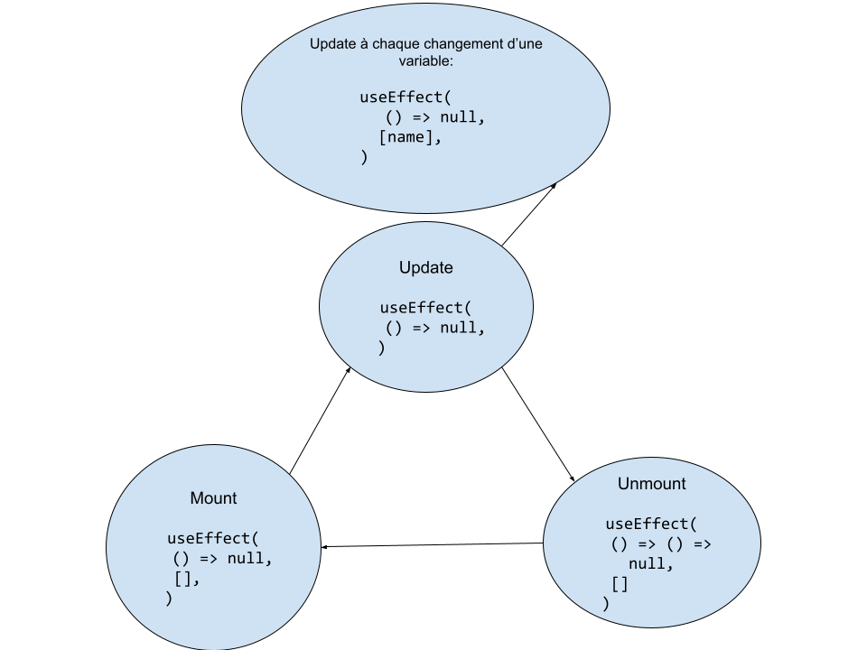

# Les Effets

En react, les effets sont des fonctions s'éxécutant à des moments précis. Elles servent à produire des "Side Effect". Les side effects, c'est tout ce que l'utilisateur ne voie pas à l'écran !

## Comprendre `useEffect`

En react, il éxiste useEffect prévu pour la création de side effect.

### Éxemple :

```tsx
import React, { ChangeEvent, ReactElement, useEffect, useState } from 'react'
import { fetchTodos, saveTodo } from '../utils/todo-api'

export default function TodoList(): ReactElement {
  const [todos, setTodos] = useState<Type.TodoList>([Type.createTodo()])

  useEffect(() => {
    console.log('Ici nous pouvons récupérer les TODOS depuis une api !')
  }, [])

  ...
}

```

Voici une image récapitulatif du fonctionnement de useEffect :


